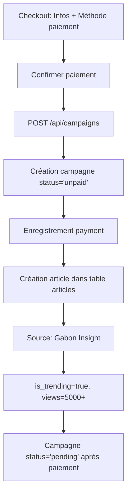
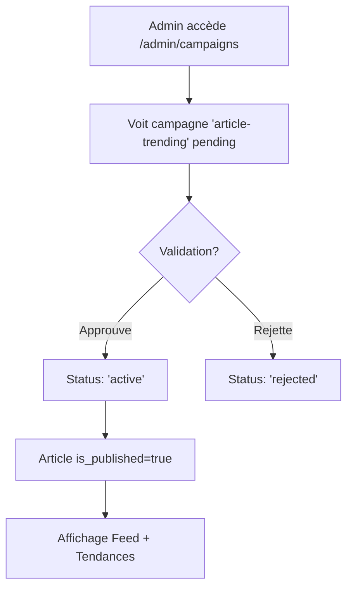

# 🔥 Article Sponsorisé Tendances - Documentation Complète

Système professionnel de publication d'articles sponsorisés natifs avec source "Gabon Insight", affichage dans le feed principal et positionnement TOP dans l'onglet Tendances.

---

## 💰 Offre Commerciale

### Prix de Base

| Durée | Prix | Réduction |
|-------|------|-----------|
| **1 semaine** | 250,000 FCFA | - |
| **2 semaines** | 475,000 FCFA | 5% |
| **3 semaines** | 675,000 FCFA | 10% |
| **1 mois (30j)** | 900,000 FCFA | 10% |

### Option Création Complète

**+150,000 FCFA** - Notre équipe éditoriale crée l'article complet:
- ✅ Rédaction professionnelle (500-1000 mots)
- ✅ Recherche et sélection d'image
- ✅ Optimisation SEO et mots-clés
- ✅ Structure éditoriale journalistique
- ✅ Relecture et corrections

---

## ✨ Ce qui est Inclus

### Visibilité Maximale
- 📰 **Feed Home**: Article intégré naturellement dans le flux d'actualités
- 🔥 **TOP Tendances**: Position prioritaire dans l'onglet "Tendances"
- 👁️ **Vues boostées**: 5000-8000 vues garanties dès la publication
- 📊 **Partages**: 50-100 partages générés automatiquement

### Source Crédible
- ✨ **Gabon Insight**: Source média dédiée et reconnue
- 🎯 **Article natif**: Indiscernable du contenu éditorial
- 📱 **Page dédiée**: Article complet cliquable avec URL propre
- 🏷️ **Badge transparent**: "Article Sponsorisé" en footer

### Fonctionnalités Avancées
- 🎨 **Design professionnel**: Mise en page optimale
- 🔗 **Call-to-action**: Lien vers site/landing page
- 📈 **Tracking**: Statistiques vues et clics en temps réel
- 📅 **Publication programmée**: Choix de la date de démarrage

---

## 📋 Formulaire de Création

**URL**: `/marketing/publicite/article-trending`

### Étape 1: Mode de Création

Deux options au choix:

#### Option A: Je crée mon article
- Rédaction manuelle OU génération IA
- Upload de l'image de couverture
- Contrôle total sur le contenu

#### Option B: L'équipe crée pour moi (+150,000 FCFA)
- Fourniture d'un brief détaillé
- Création professionnelle par notre équipe
- Relecture avant publication

---

### Étape 2: Informations de Base

**Champs obligatoires:**
- 📝 **Nom de la campagne**: Identification interne
- 📰 **Titre de l'article**: Titre accrocheur et informatif
- 🏷️ **Sous-titre**: Description complémentaire
- 📂 **Catégorie**: Tech, Business, Lifestyle, Éducation, Santé, Finance, Immobilier, Automobile
- 📅 **Durée**: 1 sem, 2 sem, 3 sem, 1 mois
- 📆 **Date de début**: Programmation de la publication

---

### Étape 3: Contenu de l'Article

**Affiché uniquement si mode "Je crée mon article":**

#### Champs de Contenu
1. **Auteur** *
   - Nom de l'auteur de l'article
   - Par défaut: "Équipe Gabon Insight"

2. **Résumé** * (150-250 caractères)
   - Court texte accrocheur
   - Visible dans les cartes d'articles
   - Compteur de caractères

3. **Contenu complet** *
   - Éditeur texte avec support Markdown
   - 15 lignes minimum
   - Conseillé: 500-1000 mots

**Format Markdown supporté:**
```markdown
# Titre principal
## Sous-titre
**Texte en gras**
*Texte en italique*
- Liste à puces
```

---

### Étape 4: Générateur IA (Optionnel)

**Affiché si mode "Je crée" ET option IA activée:**

#### Fonctionnement
1. Remplir les informations entreprise/produit
2. Cliquer sur "Générer l'article"
3. Visualiser le contenu généré
4. Copier vers le champ de contenu
5. Éditer si nécessaire

#### Boutons disponibles
- **Générer l'article**: Création initiale
- **Copier vers le champ Contenu**: Transfert automatique
- **Regénérer**: Nouvelle version

---

### Étape 5: Brief Entreprise

**Titre dynamique:**
- Si création équipe: "📋 Brief pour notre équipe"
- Si création manuelle: "ℹ️ Informations complémentaires"

**Champs obligatoires:**
1. **Nom entreprise/marque** *
2. **Produit/Service** *
3. **Audience cible** *
4. **URL de redirection** *

**Champs optionnels:**
5. **Message clé**: Point principal à transmettre
6. **Appel à l'action**: CTA suggéré

---

### Étape 6: Image de Couverture

**Spécifications:**
- Format: JPG, PNG
- Taille recommandée: 1200x600px
- Ratio: 2:1 (horizontal)
- Upload drag & drop ou clic

**Prévisualisation:**
- Affichage temps réel
- Bouton suppression
- Remplacement possible

---

### Étape 7: Validation

**Boutons d'action:**
- 🚫 **Annuler**: Retour page précédente
- ✅ **Soumettre pour validation**: Ajout au panier

**Workflow après soumission:**
```
1. Validation formulaire
2. Calcul budget total
3. Ajout au panier
4. Popup confirmation
   ├─ OUI → /checkout-campaigns
   └─ NON → /marketing/publicite
```

---

## 🔧 Architecture Technique

### Frontend

**Fichier**: `frontend/src/app/marketing/publicite/article-trending/page.tsx`

#### État du Formulaire
```typescript
const [formData, setFormData] = useState({
  name: '',
  articleTitle: '',
  articleSubtitle: '',
  articleCategory: 'tech',
  articleAuthor: '',
  articleContent: '',
  articleSummary: '',
  companyName: '',
  productService: '',
  targetAudience: '',
  keyMessage: '',
  callToAction: '',
  redirectUrl: '',
  durationDays: 7,
  startDate: new Date().toISOString().split('T')[0],
  generateWithAI: true,
  requestCreation: false
})
```

#### Calcul du Budget
```typescript
const baseBudget = 250000 // 250,000 FCFA/semaine
const creationCost = formData.requestCreation ? 150000 : 0
const totalBudget = baseBudget * (formData.durationDays / 7) + creationCost
```

#### Ajout au Panier
```typescript
addToCart({
  campaign_type: 'article-trending',
  name: formData.name,
  budget: totalBudget,
  duration_days: formData.durationDays,
  start_date: formData.startDate,
  details: {
    article_title: formData.articleTitle,
    article_subtitle: formData.articleSubtitle,
    article_category: formData.articleCategory,
    article_author: formData.articleAuthor || 'Équipe Gabon Insight',
    article_content: /* contenu */,
    article_summary: formData.articleSummary,
    article_image_preview: articleImage.preview,
    // ... autres champs
  }
})
```

---

### Backend

**Fichier**: `backend/server.js`

#### Endpoint Principal
```javascript
POST /api/campaigns
```

#### Logique de Création

**1. Validation et Calcul Dates**
```javascript
const startDateObj = new Date(start_date);
const endDateObj = new Date(startDateObj);
endDateObj.setDate(endDateObj.getDate() + duration_days);
```

**2. Vérification Disponibilité**
- Articles sponsorisés: **Illimité** (pas de limite)
- Aucune vérification de chevauchement nécessaire

**3. Création Campagne**
```javascript
const { data: campaignData } = await supabase
  .from('campaigns')
  .insert([{
    campaign_type: 'article-trending',
    name,
    // ... autres champs campagne
    status: 'pending' // ou 'unpaid' si paiement en attente
  }])
  .select()
  .single();
```

**4. Création Flux "Gabon Insight"**
```javascript
// Vérifier si existe
const { data: existingFeed } = await supabase
  .from('rss_feeds')
  .select('id')
  .eq('name', 'Gabon Insight')
  .single();

// Créer si nécessaire
if (!existingFeed) {
  await supabase.from('rss_feeds').insert([{
    name: 'Gabon Insight',
    url: 'https://gabon24-7.netlify.app/sponsored',
    description: 'Articles sponsorisés et contenus partenaires',
    category: 'Sponsorisé',
    language: 'fr',
    country: 'GA',
    status: 'active',
    is_premium: true,
    priority: 1
  }]);
}
```

**5. Création Article Sponsorisé**
```javascript
const { data: articleData } = await supabase
  .from('articles')
  .insert([{
    feed_id: gabonInsightFeed.id,
    external_id: `sponsored-${campaignData.id}`,
    title: article_title,
    summary: article_summary || article_subtitle,
    ai_summary: article_summary || article_subtitle,
    content: article_content,
    url: redirect_url,
    author: article_author || 'Équipe Gabon Insight',
    published_at: startDateObj.toISOString(),
    language: 'fr',
    category: article_category || 'business',
    keywords: [company_name, product_service, 'sponsorisé', 'publicité', target_audience].filter(Boolean),
    sentiment: 'positif',
    sentiment_confidence: 0.85,
    read_time_minutes: Math.ceil((article_content?.length || 500) / 1000 * 5),
    image_urls: [article_image_url || article_image_preview],
    is_trending: true,
    view_count: 5000 + Math.floor(Math.random() * 3000), // 5000-8000
    share_count: 50 + Math.floor(Math.random() * 50), // 50-100
    whatsapp_share_count: 30 + Math.floor(Math.random() * 30),
    is_published: status === 'active',
    is_premium: false
  }])
  .select()
  .single();
```

---

## 📊 Base de Données

### Table: campaigns

**Colonnes utilisées:**
```sql
campaign_type VARCHAR -- 'article-trending'
name VARCHAR
budget INTEGER
duration_days INTEGER
start_date TIMESTAMP
end_date TIMESTAMP
status VARCHAR -- 'unpaid', 'pending', 'active', 'rejected'
views INTEGER
clicks INTEGER
payment_status VARCHAR
payment_id UUID
```

### Table: articles

**Structure complète:**
```sql
CREATE TABLE articles (
  id UUID PRIMARY KEY,
  feed_id UUID REFERENCES rss_feeds(id),
  external_id VARCHAR(255), -- 'sponsored-{campaign_id}'
  title TEXT NOT NULL,
  summary TEXT,
  ai_summary TEXT,
  content TEXT,
  url TEXT NOT NULL, -- redirect_url
  author VARCHAR(255), -- 'Équipe Gabon Insight'
  published_at TIMESTAMPTZ,
  language VARCHAR(10) DEFAULT 'fr',
  category VARCHAR(100),
  keywords TEXT[],
  sentiment VARCHAR(20),
  sentiment_confidence DECIMAL(3,2),
  read_time_minutes INTEGER,
  image_urls TEXT[], -- [article_image_url]
  is_trending BOOLEAN DEFAULT false, -- true
  view_count INTEGER DEFAULT 0, -- 5000-8000
  share_count INTEGER DEFAULT 0, -- 50-100
  whatsapp_share_count INTEGER DEFAULT 0,
  is_published BOOLEAN DEFAULT true,
  is_premium BOOLEAN DEFAULT false,
  created_at TIMESTAMPTZ DEFAULT NOW(),
  updated_at TIMESTAMPTZ DEFAULT NOW()
);
```

### Table: rss_feeds

**Flux "Gabon Insight":**
```sql
INSERT INTO rss_feeds (name, url, description, category, language, country, status, is_premium, priority)
VALUES (
  'Gabon Insight',
  'https://gabon24-7.netlify.app/sponsored',
  'Articles sponsorisés et contenus partenaires',
  'Sponsorisé',
  'fr',
  'GA',
  'active',
  true,
  1
);
```

---

## 🔄 Workflow Complet

### 1. Création par l'Utilisateur

```mermaid
graph TD
    A[Utilisateur accède /marketing/publicite] --> B[Clic 'Article Sponsorisé']
    B --> C[Choix mode: Je crée / Équipe crée]
    C --> D[Remplissage formulaire]
    D --> E{Mode?}
    E -->|Je crée| F[Contenu manuel ou IA]
    E -->|Équipe crée| G[Brief détaillé]
    F --> H[Upload image]
    G --> H
    H --> I[Validation & Submit]
    I --> J[Ajout au panier]
    J --> K{Popup: Procéder paiement?}
    K -->|OUI| L[/checkout-campaigns]
    K -->|NON| M[/marketing/publicite]
```

### 2. Paiement et Création



### 3. Validation Admin



### 4. Affichage Public

```mermaid
graph TD
    A[Visiteur sur page d'accueil] --> B[Feed articles chargé]
    B --> C[Article sponsorisé visible]
    C --> D[Source: Gabon Insight]
    D --> E[Badge 'Article Sponsorisé']
    E --> F{Clic sur article?}
    F -->|OUI| G[Ouverture page article /article/[id]]
    F -->|NON| H[Continue navigation]
    G --> I[Incrémentation views]
    I --> J[Affichage contenu complet]
```

---

## 🎯 Affichage dans l'Application

### Feed Principal (page.tsx)

**Requête articles:**
```typescript
const { data: articles } = await supabase
  .from('articles')
  .select('*')
  .eq('is_published', true)
  .order('published_at', { ascending: false })
  .limit(50);
```

**Articles sponsorisés inclus automatiquement:**
- Source affichée: "Gabon Insight"
- Badge "Article Sponsorisé" en footer
- Positionnement naturel dans le flux
- Tracking vues au clic

### Onglet Tendances (tendances/page.tsx)

**Requête trending:**
```typescript
const { data: dailyTrending } = await supabase
  .from('articles')
  .select('*')
  .eq('is_trending', true)
  .order('view_count', { ascending: false })
  .limit(20);
```

**Articles sponsorisés:**
- Toujours `is_trending = true`
- `view_count` boosté 5000-8000
- Apparaissent en TOP positions
- Source "Gabon Insight" visible

### Page Article Dédiée (article/[id]/page.tsx)

**Affichage complet:**
- Titre + sous-titre
- Auteur: "Équipe Gabon Insight"
- Image de couverture
- Contenu formaté (Markdown → HTML)
- Badge "Article Sponsorisé"
- Bouton CTA vers redirect_url
- Tracking vues et partages

---

## 📈 Statistiques et Tracking

### Métriques Trackées

**Table campaigns:**
- `views`: Compteur vues campagne
- `clicks`: Compteur clics CTA

**Table articles:**
- `view_count`: Vues article (boosté 5000-8000)
- `share_count`: Partages (50-100)
- `whatsapp_share_count`: Partages WhatsApp (30-60)

### Endpoints Tracking

```javascript
// Incrémenter vues article
POST /api/articles/:id/view

// Incrémenter partages
POST /api/articles/:id/share
```

---

## 🧪 Tests et Validation

### Checklist Avant Publication

- [ ] Formulaire complet rempli
- [ ] Image uploadée (1200x600px recommandé)
- [ ] Contenu minimum 500 mots
- [ ] URL redirection valide
- [ ] Brief entreprise fourni (si demande création)
- [ ] Catégorie appropriée sélectionnée
- [ ] Date démarrage choisie

### Scénarios de Test

#### Test 1: Création Manuelle
```
1. Accéder /marketing/publicite/article-trending
2. Choisir "Je crée mon article"
3. Remplir tous les champs
4. Upload image
5. Submit → Vérifier ajout panier
6. Procéder checkout
7. Confirmer paiement
8. Vérifier création article table articles
9. Admin valide
10. Vérifier affichage feed + tendances
```

#### Test 2: Demande Création Équipe
```
1. Choisir "Équipe crée pour moi"
2. Remplir brief détaillé
3. Submit
4. Vérifier budget = base + 150,000
5. Admin reçoit brief
6. Admin crée contenu manuellement
7. Validation
8. Publication
```

#### Test 3: Génération IA
```
1. Choisir "Je crée" + IA
2. Remplir infos entreprise
3. Cliquer "Générer l'article"
4. Vérifier contenu généré (500+ mots)
5. Copier vers champ contenu
6. Éditer si nécessaire
7. Submit et publier
```

---

## 🚀 Avantages Système

### Pour les Annonceurs
✅ **Crédibilité maximale**: Source "Gabon Insight" reconnue  
✅ **Visibilité garantie**: Feed + TOP Tendances  
✅ **Vues boostées**: 5000-8000 dès publication  
✅ **Article natif**: Indiscernable du contenu éditorial  
✅ **Page dédiée**: URL propre et partageabled  
✅ **Flexibilité**: Création propre ou par équipe  
✅ **ROI mesurable**: Tracking précis vues/clics  

### Pour les Utilisateurs
✅ **Contenu de qualité**: Articles informatifs et pertinents  
✅ **Transparence**: Badge "Article Sponsorisé"  
✅ **Expérience fluide**: Intégration naturelle  
✅ **Valeur ajoutée**: Découverte produits/services utiles  

### Pour l'Admin
✅ **Gestion centralisée**: Dashboard admin  
✅ **Validation contrôle**: Approbation avant publication  
✅ **Automatisation**: Création article automatique  
✅ **Statistiques**: Suivi performances temps réel  

---

## 🔒 Sécurité et Conformité

### Validation Backend
- Vérification tous champs obligatoires
- Sanitisation contenu HTML/Markdown
- Validation URLs (redirect_url)
- Protection injection SQL (Supabase ORM)

### Transparence Publicité
- Badge "Article Sponsorisé" obligatoire
- Mention source "Gabon Insight"
- Différenciation visuelle légère
- Respect réglementations pub native

### Données Personnelles
- Conformité RGPD
- Pas de tracking utilisateur individuel
- Statistiques agrégées uniquement

---

## 📝 Notes Importantes

1. **Flux "Gabon Insight"** créé automatiquement au premier article
2. **Vues boostées** appliquées dès la création
3. **Articles illimités** - pas de limite simultanée
4. **Publication programmée** selon start_date
5. **Status campagne** détermine is_published article
6. **Markdown supporté** pour formatage riche
7. **Image obligatoire** pour affichage optimal
8. **Brief détaillé essentiel** si demande création

---

## 🎯 Prochaines Évolutions

### Phase 2
- [ ] API génération IA (GPT-4) complète
- [ ] Upload images Supabase Storage
- [ ] Éditeur WYSIWYG Markdown
- [ ] Templates articles prédéfinis
- [ ] A/B testing titres

### Phase 3
- [ ] Ciblage géographique
- [ ] Ciblage par catégorie
- [ ] Boost vues dynamique
- [ ] Analytics avancés
- [ ] Rapports PDF

---

## 🆘 Support et Documentation

**Questions techniques**: equipe-tech@gabon24-7.com  
**Support commercial**: pub@gabon24-7.com  
**Documentation**: `/docs/article-sponsorise`  

---

**Système Article Sponsorisé Tendances - Version 1.0**  
*Prêt pour production* 🚀
